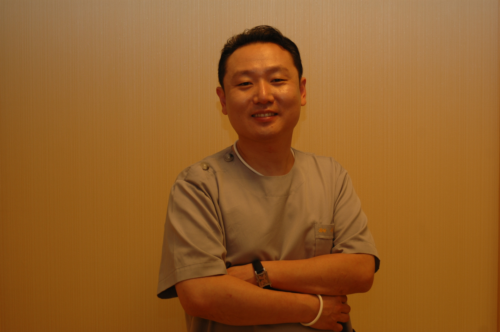

서일경 (徐一慶) 원장 의학 박사, 성형외과 전문의

아이리스 성형외과의원 대표원장

대한 성형외과학회 정회원

대한 미용성형외과학회 정회원

대한 두개안면성형외과학회 정회원

대한 수부외과학회 정회원

국제 미용성형수술학회(ISAPS) 정회원

국제 성형외과학회(IPRAS) 정회원

前 인제대학교 의과대학 임상 외래교수

前 대한성형외과의사회 부회장

前 부산시성형외과의사회 회장

前 부산광역시의료관광추진협의회 위원

前 부산관광공사 비상임이사

前 부산문화관광축제조직위원회 집행위원

前 부산광역시 항노화산업지원위원회 위원

前 한중 의료미용 테마크루즈 추진협의회 공동대표

# 서일경 (徐一慶) 원장

## 📌 Brief Summary

서일경 원장은 아이리스 성형외과의원 대표원장이자 의학 박사로, 성형외과 전문의로서의 임상 활동은 물론 부산 지역의 의료 관광 활성화와 항노화 산업 발전에 크게 기여해 온 의료인입니다.

## 📖 Core Content

서일경 원장의 경력은 크게 **전문적 의료 역량**과 **지역사회 및 의료 행정 활동**의 두 가지 축으로 나뉩니다.

### 1. 전문 의료 역량

- **전문 자격:** 성형외과 전문의로서 대한성형외과학회, 대한미용성형외과학회 등 주요 국내 학회뿐만 아니라 ISAPS(국제미용성형수술학회), IPRAS(국제성형외과학회) 등 국제적인 학술 단체에서 정회원으로 활동하며 최신 성형외과적 지식과 기술을 교류하고 있습니다.
    
- **교육 활동:** 인제대학교 의과대학 임상 외래교수를 역임하며 후학 양성과 임상 교육에 기여했습니다.
    

### 2. 지역사회 기여 및 의료 행정

- **의료 산업 리더십:** 대한성형외과의사회 부회장, 부산시성형외과의사회 회장을 역임하며 성형외과 의료계의 위상을 높이고 제도적 발전을 도모했습니다.
    
- **부산 의료 관광 및 산업 육성:** 부산광역시 의료관광추진협의회 위원, 부산관광공사 비상임이사, 항노화산업지원위원회 위원 등을 거치며 부산을 의료 관광 거점 도시로 성장시키는 데 핵심적인 역할을 수행했습니다.
    
- **문화 및 국제 교류:** 한중 의료미용 테마크루즈 추진협의회 공동대표를 지내는 등 의료와 문화 콘텐츠를 결합한 새로운 관광 모델을 개발하고 국제적 네트워크를 확장하는 데 앞장섰습니다.
    

## 🔗 Knowledge Connections

- **관련 분야:** 성형외과, 미용외과, 의료 관광, 항노화 산업(Anti-aging), 지역 의료 행정
    
- **주요 활동 지역:** 부산광역시
    
- **참고 사항:** 성형외과 전문의로서의 전문성과 부산광역시의 도시 브랜딩(의료 관광)을 연결한 행보가 특징적인 의료인입니다.
    

---

_Last updated: 2026년 4월 20일_

---

서일경 원장님과 관련하여 추가로 확인하고 싶은 정보나, 특정 목적(소개서 작성 등)으로 정리해 드릴 내용이 있으신가요?

]]

![[IMG_2306.jpeg]]

